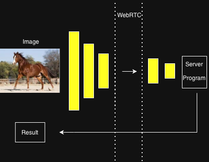
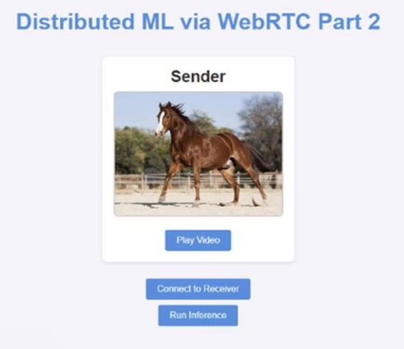
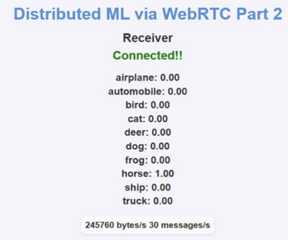

# DNN-inference-using-split-layer
Privacy-preserving AI, Split Inference, WebRTC
# Overview
The surge in high-performance AI services presents a significant challenge for mobile devices constrained by limited resources. The conventional solution—sending raw data to the cloud for processing and receiving the result—transfers the burden of heavy data transmission and poses a severe risk of information leakage to the user.

This project aims to solve this dilemma by splitting the Deep Neural Network (DNN) layers between the user's device (Client) and the cloud server (Server). By performing initial inference on the mobile device, we aim to prevent raw data exposure and transmit only the smaller latent data (intermediate results), thereby reducing the consumer's transmission overhead (packet size).

The primary objective is to quantify this reduction by measuring the packet transmission volume at various layer split points. Simultaneously, we seek to demonstrate the stability (fidelity) of this approach by comparing the results from split inference with those from direct local inference, ensuring no data distortion occurs.

* Core Objective: Enhance data security and reduce transmission costs in mobile AI services by implementing split DNN inference.
* Key Metric: Packet Transmission Volume measured at different layer boundaries.
* Verification: Comparing inference results (local vs. remote) to confirm Data Fidelity.

# Methodology & Implementation
The implementation focused on establishing a real-time communication environment using WebRTC, partitioning the model using ONNX, and executing the inference and data transfer logic using JavaScript on both the client and server sides.

**System Architecture**

* Communication Setup: A P2P communication environment between the Client (Sender) and the Server (Receiver) was established using WebRTC. Socket.IO was used as the signaling server for exchanging SDP and ICE candidates, facilitating the connection (as detailed in server.js). 

* Data Channel: A Data Channel was created via RTCPeerConnection to securely transmit the high-volume latent data (as a Float32Array buffer) in real-time.

**Model Partitioning and ONNX Runtime**

* Partitioning: A CNN model (e.g., for CIFAR-10 classification) was partitioned using the ONNX format into two modules: model_sender.onnx (Client side) and model_recv.onnx (Server side).

* Inference Engine: The ONNX Runtime (ort) JavaScript library was utilized on both the client and server to execute the partitioned model segments.

**Client-Side Implementation (dnn_sender_script.js)**
* Data Acquisition & Preprocessing:

Video frames are captured from localVideo_1 at a frequency of 30fps.
The frames are resized to 32x32 and transformed by the preprocessImage function into a Float32Array tensor with dimensions [1, 3, 32, 32] (It is matching for original CNN model's input)

* Client Inference & Transmission:

The model_sender.onnx is loaded and inference is executed.
The Float32Array buffer of the resulting intermediate tensor (latent data) is directly sent to the server using dataChannel.send(buffer), minimizing data conversion overhead.

**Server-Side Implementation (dnn_recv_script.js)**

* Data Reception:

The dataChannel.onmessage handler receives the latent data as an ArrayBuffer from the Client.
This buffer is accurately converted back to a Float32Array tensor using new Float32Array(rec_buf).

* Server Inference & Result Processing:

The model_recv.onnx is loaded in the test function. The received tensor (e.g., [1, 32, 16, 16]) is used as input for the final inference.
The final classification probabilities are displayed on the webpage via the labelprocess function.

* Transmission Volume Tracking:

Network traffic is monitored by periodically calling peerConnection.getStats() and specifically tracking the data-channel's bytesReceived to display the real-time transmission volume (bytes/s).

# Result
**sender**

**receiver**

**Data Transmission Reduction**

* Latent Data Advantage: The strategy of transmitting latent data instead of raw data provided a significant reduction in data transmission volume, as quantified by the measured bytes/s.
* Exponential Reduction Curve: The observed reduction benefit followed an exponentially decreasing trend as the split point moved deeper into the model. This is consistent with the CNN architecture, where the most substantial dimensionality reduction (and thus data compression) occurs in the initial layers.

**Data Fidelity and Safety**

* No Distortion: Comparison between the remote result (split inference) and the local result (direct inference) confirmed that no data distortion occurred. This validates the stability of the WebRTC buffer transfer and ONNX Runtime processing.
* Security Assurance: Transmitting only the abstract latent data ensures that the consumer's raw input data is protected, fundamentally eliminating the risk of information leakage.

# Key Insights & Reflection
**Importance of Protocol-Specific Details**
* Data Channel Ordering: A primary hurdle encountered was the sequencing issue of the Data Channel transfer, which is highly dependent on the underlying WebRTC and Socket.IO protocols.
* Resolution: The problem was resolved by meticulous debugging and referencing the official documentation for RTCPeerConnection and its createDataChannel and ondatachannel handlers, ensuring the correct peer initiated the channel creation and the non-initiator correctly received it.
* Lesson Learned: This underscored the critical importance of a holistic understanding of all interacting sub-components (e.g., WebRTC signaling, ONNX tensor layout) in a complex system. Moving forward, I commit to proactively studying and communicating about related components, even those outside my immediate ownership, to ensure system-wide stability.
**Future Possibilities**
The Split Layer concept can be further developed to enhance both efficiency and user utility
* Customized Layer Augmentation: Leveraging the client's processing capability, user-specific, lightweight layers could be appended after the Client Module to perform personalized inference, thereby increasing user utility
